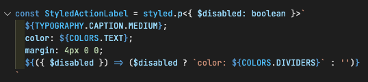

# General Notes

## User Experience

- Under "Save Themes", preset name should clear after user saves preset.
- On click of any action button, some confirmation to the user would be good

## Code

- Learn about [functional components and hooks](https://reactjs.org/docs/hooks-intro.html)
  - Classes are on their way out and hooks provide a way to compose functionality that were not possible before.
- More granular components. In the Controller component, I'd make each one of the sections into its own component, then keep track of state through the controller. Then you could transfer some of those methods you made inside of `App` to `Controller`. This would make it more organized
- More specific function names. Sometimes using the generic term `handleSave` and `handleChange` makes it difficult to understand what you're referring to because lots of things can be saved/changed. I'd change this to `handleThemeSave` and `handleColorChange`.
- Look into [React Refs](https://reactjs.org/docs/refs-and-the-dom.html) to get data from input fields and radio buttons
- Are you using any css from your css files or can you delete those?
- I see you have a `StyledComponents` section. Typically we only use that if components are shared. If they are specific to a specific component, the styled component should live inside the file
- Instead of changing `attrs` for example: `styled.h1.attrs`, you can just use props directly inside the styled component
  - e.g.  This example is with Typescript, but ignoring the boolean type of disabled, you should see how you can influence styles with props.
